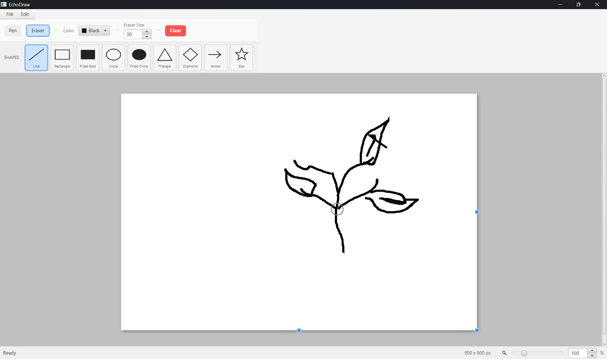

# PolyDraw 🎨



> **An object-oriented JavaFX drawing workspace built on a strict MVC architecture, featuring live-preview geometry, freehand tools, and a robust Command-pattern Undo/Redo system.**

PolyDraw is a Java application designed to demonstrate advanced Object-Oriented Programming (OOP) and Software Design Architecture (SDA) principles. By completely decoupling UI rendering from core logic, this project provides a scalable, maintainable, and feature-rich digital canvas.

## ✨ Core Features

* **Dynamic Toolset:** Smooth freehand pen and eraser tools with adjustable sizing.
* **Geometric Live Preview:** Draw lines, rectangles, circles, triangles, stars, arrows, and diamonds. Shapes animate and scale proportionately in real-time as the mouse is dragged.
* **Time-Machine Undo/Redo:** A highly reliable, stack-based history management system to instantly revert or reapply strokes and canvas clears.
* **File I/O:** Seamlessly import existing images (.png, .jpg) onto the canvas and export your artwork to your local drive.
* **Custom Workspace Resizing:** Custom-built UI handles allow the canvas boundary to be expanded or contracted dynamically on the fly.

## 🏗️ Architecture & Design Patterns

This project heavily utilizes enterprise-level software design patterns to ensure clean, decoupled, and bug-resistant code:

* **Model-View-Controller (MVC):** Strict separation between the JavaFX UI (View), the Drawing State (Model), and the Event Handlers (Controller).
* **Strategy Pattern:** Hot-swapping drawing logic (`PenStrategy`, `ShapeStrategy`, `EraserStrategy`) allowing the Controller to remain blind to specific tool implementations.
* **Factory Pattern:** Centralized creation of shape objects (`ShapeFactory`) to abstract complex geometry math away from the mouse event listeners.
* **Command Pattern:** Encapsulation of drawing actions into generic `ImageCommand` objects, which are pushed to History Stacks to prevent timeline paradoxes during Undo/Redo actions.

## 💻 Tech Stack

* **Language:** Java 
* **GUI Framework:** JavaFX
* **Concepts:** OOP, Solid Principles, Design Patterns
* **IDE Recommended:** Eclipse / IntelliJ IDEA

## 🚀 How to Run

1. Clone this repository to your local machine:
   ```bash
   git clone https://github.com/yourusername/PolyDraw.git
   ```
2. Ensure you have the JavaFX SDK configured in your IDE.
3. Add the necessary VM arguments for JavaFX. Example:
   ```bash
   --module-path /path/to/javafx/lib --add-modules javafx.controls,javafx.fxml,javafx.swing
   ```
4. Run the `Main.java` file located in the root package to launch the application.

---
*Developed by Abdul Basit Khan*
